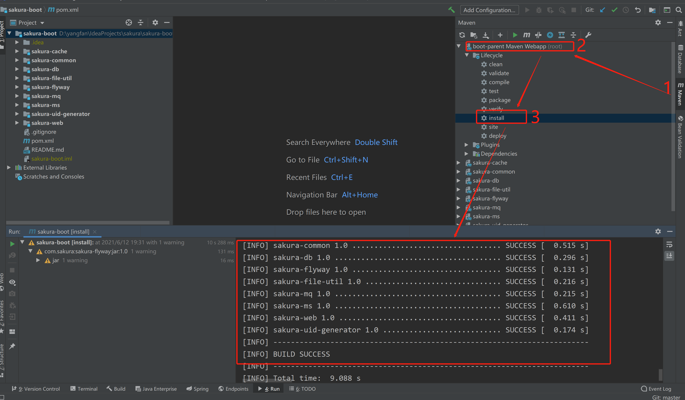
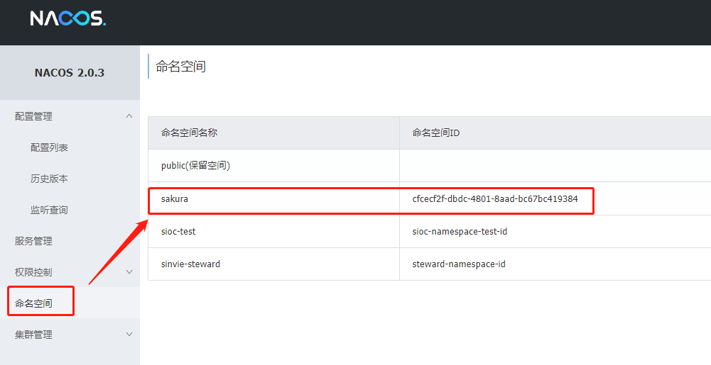
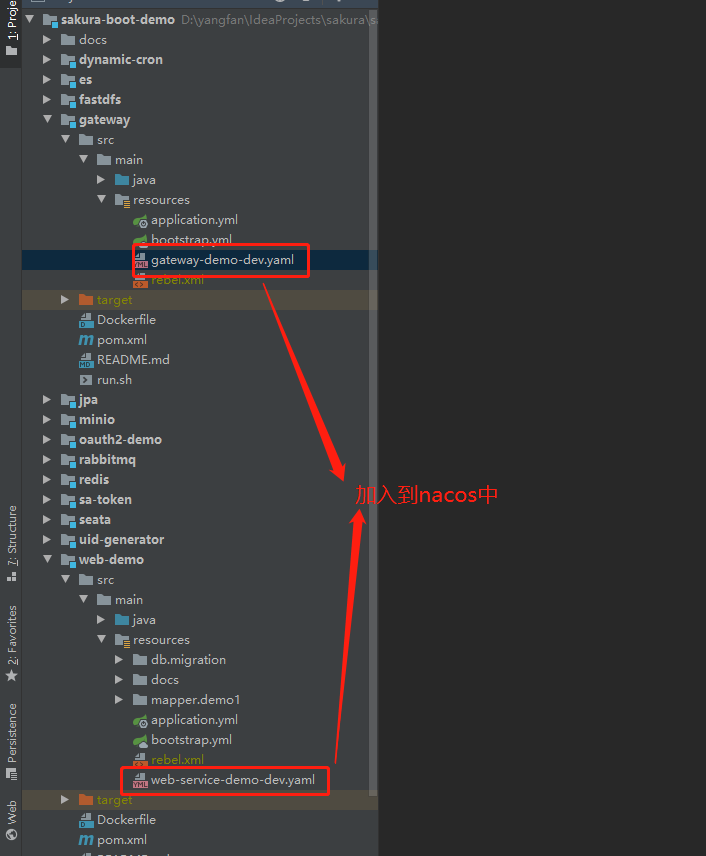
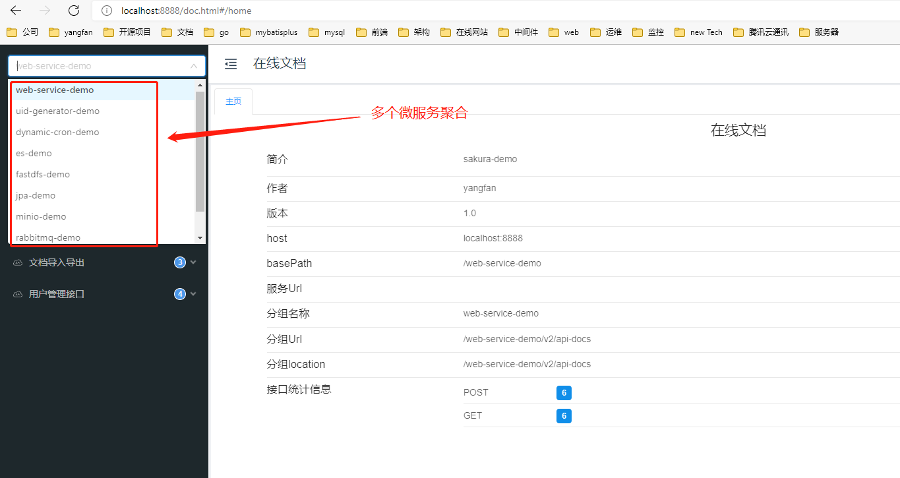
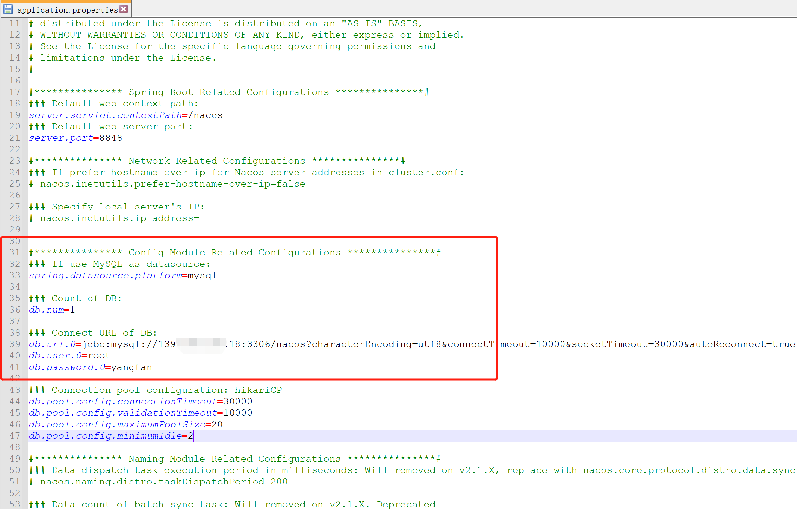

## 各demo模块介绍

**注意**：各`demo`都使用`nacos`发现、配置和管理微服务，如不需要，去掉`pom.xml`中的`sakura-ms`依赖即可

| 模块名           | 模块介绍                           | 启动端口               | 依赖的中间件         |
|:-------------:|:------------------------------:|:------------------:|:--------------:|
| dynamic-cron  | 动态定时任务示例                       | 8087               | mysql          |
| es            | elasticsearch通用查询示例            | 8095               | es             |
| fastdfs       | fastdfs工具类文件上传下载示例             | 8081               | fastdfs        |
| gateway       | SpringCloud Gateway网关          | 8888               | redis          |
| jpa           | jpa+querydsl常见的crud示例          | 8082               | mysql          |
| message       | 消息发送（邮件发送示例、短信发送示例待开发）         | 8088               | 可直接运行          |
| minio         | minio工具类文件上传示例                 | 8083               | mino           |
| oauth2        | 认证服务，负责对登录用户进行认证（两个子模块）        | 8888、9100          | msyql、redis    |
| rabbitmq      | 使用rabbitmq工具类生产消费示例            | 8084               | rabbitmq、mysql |
| redis         | 使用redis工具类示例                   | 8085               | redis          |
| sa-token      | 使用satoken示例（三个子模块）             | 8888、9101、9102     | mysql、redis    |
| seata         | seata使用示例（三个子模块）               | 10000、 10001、10002 | seata、mysql    |
| uid-generator | 分布式id使用示例                      | 8086               | mysql          |
| web           | 基于MybatisPlus的orm框架，常见的web开发示例 | 8080               | mysql          |
| web-socket    | websocket的广播单播使用示例             | 8096               | 可直接运行          |

## 开发计划

| 功能                   | 进度          |
| -------------------- | ----------- |
| Netty传输大文件、分片发送、断点续传 | 已完成         |
| 权限系统demo             | 已完成         |
| 配置文件敏感信息加密           | 已完成，待补充使用文档 |
| 用户信息脱敏注解       | 已完成         |
| 国产数据库兼容插件开发     |   已完成       |

# 快速上手

## 启动项目

1. 拉取脚手架[sakura-boot](https://github.com/yanjingfan/sakura-boot)

2. `maven install`一下**sakura-boot**脚手架，即可打成`jar`包到本地的`maven`仓库
   
   

3. `nacos`配置
   
   + `nacos`新建命名空间id
     
     **命名空间名称**：sakura  
     
     **命名空间ID**：cfcecf2f-dbdc-4801-8aad-bc67bc419384
     
     
   
   + 将各项目的配置导入到nacos，如图：
     
     

4. 拉取demo工程[sakura-boot-demo](https://github.com/yanjingfan/sakura-boot-demo)，启动[gateway服务]()，再启动[web服务]()（会由`flyway`自动生成相关业务表），然后启动其他服务即可（先安装相关中间件），访问`localhost:8888/doc.html`
   
   

## gitlab自动化部署

此`demo`的`gateway`服务和`web-demo`服务可以在`gitlab`上进行自动化部署，可参考博客：[多模块工程gitlab（CI/CD）自动化部署](https://blog.csdn.net/yanzhenjingfan/article/details/124844630)

## 依赖的中间件

### 安装docker

```shell
#查看是否安装了docker，没有就安装docker
docker version

#安装yum-utils：
yum install -y yum-utils device-mapper-persistent-data lvm2

#为yum源添加docker仓库位置：
yum-config-manager --add-repo https://download.docker.com/linux/centos/docker-ce.repo

#安装docker
yum install docker-ce

#启动docker
systemctl start docker
```


```shell script
#修改镜像源
vim /etc/docker/daemon.json
{
 "registry-mirrors":["https://6kx4zyno.mirror.aliyuncs.com","https://docker.mirrors.ustc.edu.cn/"]
}
systemctl daemon-reload 
systemctl restart docker
```

### 安装mysql

```shell
#拉取mysql8镜像
docker pull mysql:8.0.21

#运行mysql
docker run -p 3306:3306 --restart=always --name mysql -e MYSQL_ROOT_PASSWORD=admin -d mysql:8.0.21

#进入运行MySQL的docker容器
docker exec -it mysql /bin/bash

#使用MySQL命令打开客户端，密码是启动命令里的MYSQL_ROOT_PASSWORD参数对应的值
mysql -uroot -p

#创建sakura数据库
create database sakura character set utf8mb4;

#给root赋予权限
GRANT ALL PRIVILEGES ON *.* TO 'root'@'%'WITH GRANT OPTION;

#刷新MySQL的系统权限相关表
flush  privileges;
```

### nacos安装

1. nacos启动需要依赖jdk，务必下载并配好jdk8以上版本

2. 从 [最新稳定版本](https://github.com/alibaba/nacos/releases) 下载 `nacos-server-$version.zip` 包。
   
   ```sh
   unzip nacos-server-$version.zip 或者 tar -xvf nacos-server-$version.tar.gz
   ```

3. 修改配置
   
   在`nacos/conf/application.properties`文件放开mysql的配置，配置你自己的数据库信息，如下图
   
   

4. 运行数据库sql脚本
   
   在第三步配置的数据库中新建nacos库，然后运行`nacos/conf/nacos-mysql.sql`脚本

5. 启动服务器
   
   + Linux/Unix/Mac
     
     启动命令(standalone代表着单机模式运行，非集群模式):
     
     ```sh
     sh startup.sh -m standalone
     ```
   
   + Windows
     
     启动命令(standalone代表着单机模式运行，非集群模式):
     
     ```
     startup.cmd -m standalone
     ```