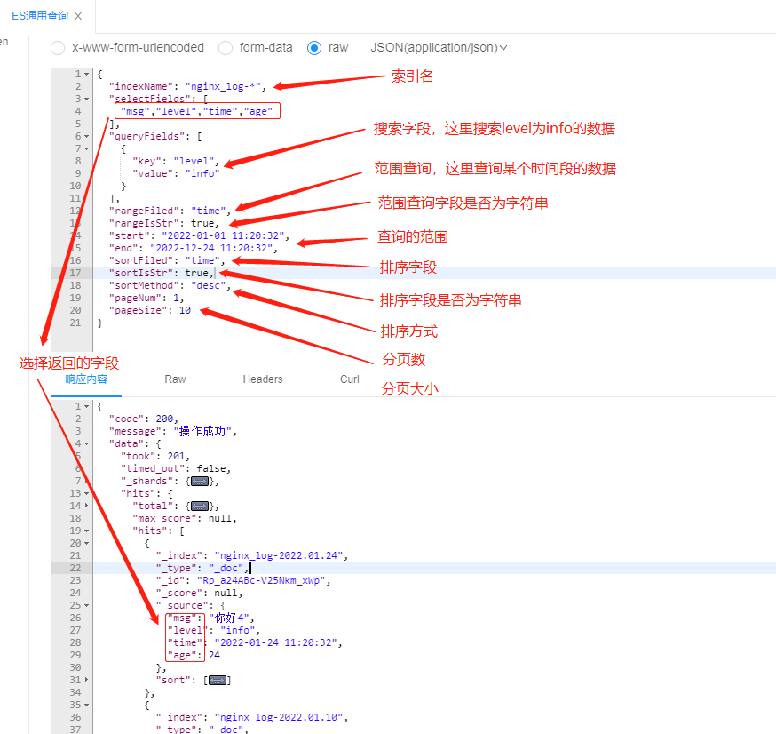

# filebet+elk安装

1. 拉取镜像

```shell
docker pull elasticsearch:7.16.3

docker pull logstash:7.16.3

docker pull elastic/filebeat:7.16.3

# ES的可视化系统（可不安装）
docker pull kibana:7.16.3
```

2. 新建配置
  
  注意：更换这些配置中你自己的ip即可
  
  - 在`/opt/elk/config`目录下新建`filebeat.yml`
    
    ```yml
    filebeat.inputs:
    - type: log
      enabled: true
      paths:
        - /home/logs/nginx/*.log
      fields:
        log_topic: nginx_log
    
    #日志输出配置
    output.logstash:
      hosts: ["192.168.3.13:5044"]
    ```
    
  - 在`/opt/elk/config`目录下新建`logstash.yml`
    
    ```yml
    http.host: "0.0.0.0"
    xpack.monitoring.elasticsearch.hosts: [ "http://192.168.3.13:9200" ]
    ```
    
  - 在`/opt/elk/config`目录下新建`logstash.conf`
    
    ```conf
    input {
      beats {
        port => 5044
      }
    }
    
    filter {
      if [fields][log_topic] == "nginx_log"{
        json {
          source => "message"
          remove_field => ["message"]
        }
        date {
          match => ["time", "yyyy-MM-dd HH:mm:ss ZZ", "ISO8601"]
          target => "@timestamp"
        }
        ruby {
              code => "event.set('timestamp', event.get('@timestamp') - 8*3600)"
            }
            ruby {
              code => "event.set('@timestamp', event.get('timestamp'))"
            }
            mutate {
              remove_field => ["timestamp"]
            }
        }
    }
    
    output {
      stdout{ codec=>rubydebug}
      if [fields][log_topic] == "nginx_log"{
              elasticsearch {
                hosts => ["192.168.3.13:9200"]
                 index => "nginx_log-%{+YYYY.MM.dd}"
              }
      }
    
    }
    ```
    
  - 在`/opt/elk/config`目录下新建`elasticsearch.yml`
    
    ```yml
    cluster.name: "elasticsearch"
    network.host: 0.0.0.0
    #快照仓库地址
    #path.repo: /opt/elk/es/snapshot
    ```
    
3. 启动服务
  
  - 启动`filebeat`，将需要监控的日志目录挂载进`filebeat`容器中
    
    ```shell
    docker run -d --name=filebeat \
    --user=root \
    -v /opt/elk/config/filebeat.yml:/usr/share/filebeat/filebeat.yml \
    -v /home/logs/nginx/:/home/logs/nginx/ \
    elastic/filebeat:7.16.3 
    ```
    
  - 启动`logstash`
    
    ```shell
    docker run -d --name=logstash -p 5044:5044 -p 9600:9600 \
    -v /opt/elk/config/logstash.yml:/usr/share/logstash/config/logstash.yml \
    -v /opt/elk/config/logstash.conf:/usr/share/logstash/pipeline/logstash.conf \
    --log-opt max-size=100m \
    logstash:7.16.3 
    ```
    
  - 启动`ElasticSearch`
    
    ```shell
    docker run -d --name es -p 9200:9200 -p 9300:9300 \
    -e "discovery.type=single-node" -e "cluster.name=elasticsearch" \
    -e "ES_JAVA_OPTS=-Xms512m -Xmx512m" \
    -v /opt/elk/config/elasticsearch.yml:/usr/share/elasticsearch/config/elasticsearch.yml \
    --log-opt max-size=100m -d elasticsearch:7.16.3
    ```
    
  - 启动`kibana`
    
    ```shell
    docker run -d -p 5601:5601 \
     --name kibana \
     -e ELASTICSEARCH_HOSTS=http://192.168.3.13:9200 \
     --log-opt max-size=100m kibana:7.16.3
    ```
    
4. 造假数据
  
  在`/home/logs/nginx`目录下新建一个`test.log`日志文件，内容为`json`格式的日志：
  
  ```text
  {"file":"go:210","level":"info","msg":"你好1","time":"2022-01-10 11:20:32","age":10}
  {"file":"go:220","level":"warn","msg":"你好2","time":"2022-01-15 11:20:32","age":15}
  {"file":"go:230","level":"error","msg":"你好3","time":"2022-01-22 11:20:32","age":22}
  {"file":"go:240","level":"info","msg":"你好4","time":"2022-01-24 11:20:32","age":24}
  ```
  
5. 这些日志就会从`filebeat`=>`logstash`=>`ElasticSearch`=>`kibana`，可以在`kibana`看到这些日志数据
  
  这时候引入`sakura-es`模块，进行简单查询了，无需编写代码，一步到位。
  
  接口请求如图：
  