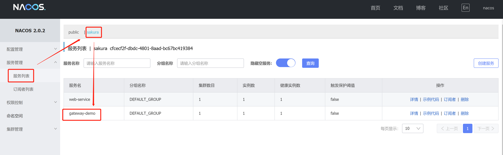

# Spring Cloud Gateway + Nacos

## 简介

Gateway是在Spring生态系统之上构建的API网关服务，基于Spring 5，Spring Boot 2和 Project Reactor等技术。Gateway旨在提供一种简单而有效的方式来对API进行路由，以及提供一些强大的过滤器功能， 例如：熔断、限流、重试等。

Spring Cloud Gateway 具有如下特性：

- 基于Spring Framework 5, Project Reactor 和 Spring Boot 2.0 进行构建；
- 动态路由：能够匹配任何请求属性；
- 可以对路由指定 Predicate（断言）和 Filter（过滤器）；
- 集成Hystrix的断路器功能；
- 集成 Spring Cloud 服务发现功能；
- 易于编写的 Predicate（断言）和 Filter（过滤器）；
- 请求限流功能；
- 支持路径重写。

## 应用架构

相关服务划分：

+ gateway-demo：网关服务
+ web-service：通过网关请求到的服务

准备工作：

+ 启动nacos服务
+ 启动网关gateway服务
+ 启动web-service服务

则可在nacos的服务列表页面看到启动的两个个服务



## gateway-demo

### 依赖冲突

> 踩坑提示：服务报错org.springframework.beans.factory.UnsatisfiedDependencyException: Error creating bean with name 'routeDefinitionRouteLocator' defined in class path resource 

不需要依赖`spring-boot-starter-web`，否则报错

```xml
<!-- 去掉这个依赖 -->
<dependency>
    <groupId>org.springframework.boot</groupId>
    <artifactId>spring-boot-starter-web</artifactId>
</dependency>
```

### 添加配置

`bootstrap.yml`

```yaml
############################################################################################
################################# 应用名称 与 配置远程配置仓库 ########################################
############################################################################################
spring :
  application :
    name : gateway-demo
  cloud:
    nacos:
      config:
        server-addr: 127.0.0.1:8848
        namespace: cfcecf2f-dbdc-4801-8aad-bc67bc419384
        file-extension: yaml #获取的yaml格式的配置
      discovery:
        server-addr: 127.0.0.1:8848
        namespace: cfcecf2f-dbdc-4801-8aad-bc67bc419384
        register-enabled: true

# 跨域响应头重复处理，避免出现 Multiple CORS header
    gateway:
      globalcors:
        cors-configurations:
          '[/**]':
            allowedOrigins: "*"
            allowedHeaders: "*"
            allowedMethods: "*"
      default-filters:
        - DedupeResponseHeader=Vary Access-Control-Allow-Origin Access-Control-Allow-Credentials, RETAIN_FIRST

  profiles:
    active: dev
```

nacos的命名空间id


`gateway-demo-dev.yaml`配置（只给出部分配置，全部配置可查看工程中的配置文件）

```yaml
server :
  port : 8888
  tomcat:
    uri-encoding: UTF-8

spring:
  cloud:
    gateway:
      disovery:
        locator:
          lower-case-service-id: true #使用小写服务名，默认是大写
          enabled: false  #开启从注册中心动态创建路由的功能，利用微服务名进行路由，开启此配置后，可以不需要配置routes
      routes:
        #路由的ID
        - id: web-service-demo
          #匹配后路由地址
          uri: lb://web-service-demo
          order: 1
          predicates: # 断言，路径相匹配的进行路由
            - Path=/web-service-demo/**
          filters:
            # - PrefixPath=/sakura
            - StripPrefix=1
```

### 测试

#### 第二步

1. 访问：`http://localhost:8888/doc.html`，不要客气，随便请求
   
   
