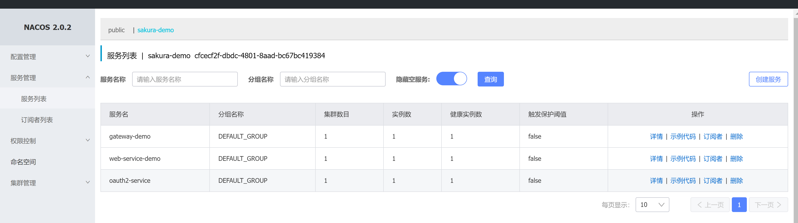
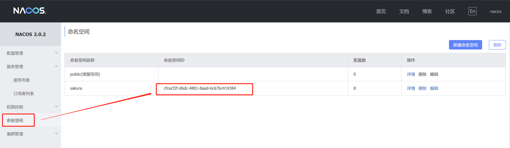
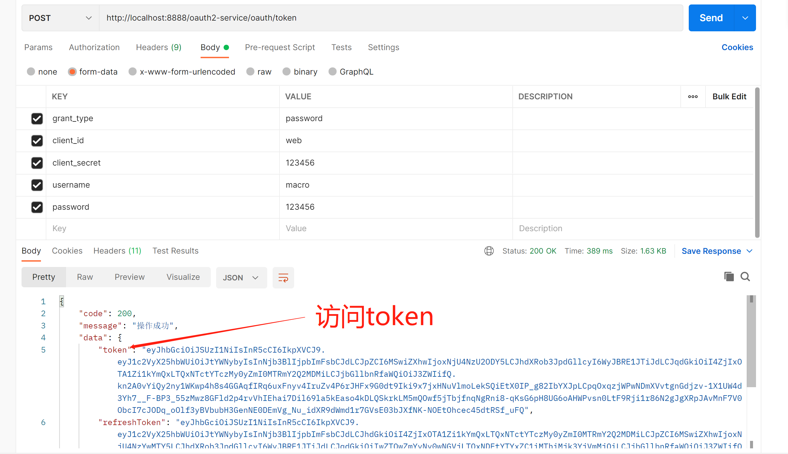
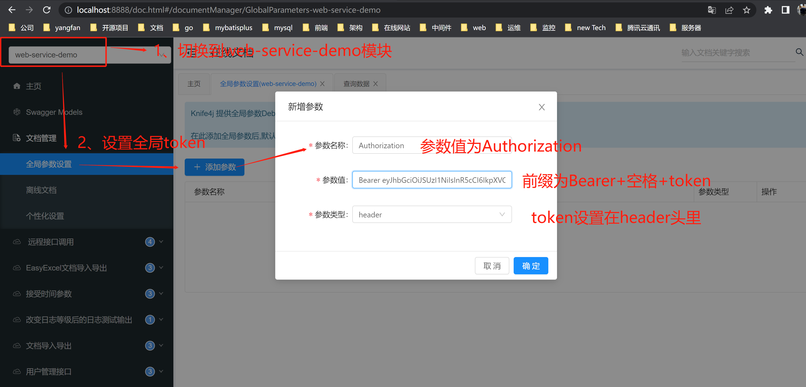
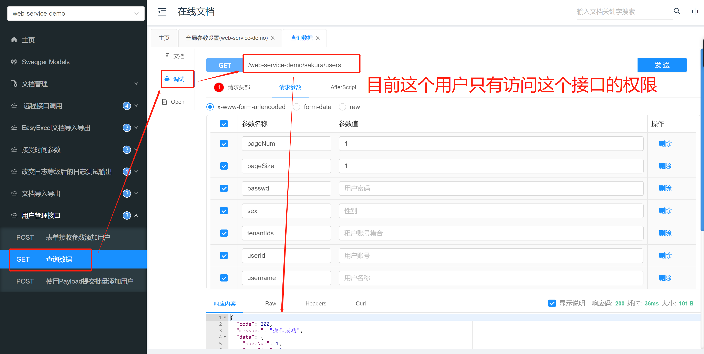

# Spring Cloud Gateway + OAuth2 + Nacos

## 简介

Gateway是在Spring生态系统之上构建的API网关服务，基于Spring 5，Spring Boot 2和 Project Reactor等技术。Gateway旨在提供一种简单而有效的方式来对API进行路由，以及提供一些强大的过滤器功能， 例如：熔断、限流、重试等。

Spring Cloud Gateway 具有如下特性：

- 基于Spring Framework 5, Project Reactor 和 Spring Boot 2.0 进行构建；
- 动态路由：能够匹配任何请求属性；
- 可以对路由指定 Predicate（断言）和 Filter（过滤器）；
- 集成Hystrix的断路器功能；
- 集成 Spring Cloud 服务发现功能；
- 易于编写的 Predicate（断言）和 Filter（过滤器）；
- 请求限流功能；
- 支持路径重写。

## 应用架构

相关服务划分：

+ gateway-demo：网关服务
+ oauth2：认证服务
+ web-service：通过网关请求到的服务

准备工作：

+ 启动nacos服务
+ 启动网关服务
+ 启动oauth2服务
+ 启动web-service服务

则可在nacos的服务列表页面看到启动的三个服务



## gateway-demo

### 依赖冲突

> 踩坑提示：服务报错org.springframework.beans.factory.UnsatisfiedDependencyException: Error creating bean with name 'routeDefinitionRouteLocator' defined in class path resource 

不需要依赖`spring-boot-starter-web`，否则报错

```xml
<!-- 去掉这个依赖 -->
<dependency>
    <groupId>org.springframework.boot</groupId>
    <artifactId>spring-boot-starter-web</artifactId>
</dependency>
```

### 添加配置

`bootstrap.yml`

```yaml
############################################################################################
################################# 应用名称 与 配置远程配置仓库 ########################################
############################################################################################
spring :
  application :
    name : gateway-demo
  cloud:
    nacos:
      config:
        server-addr: 127.0.0.1:8848
        namespace: cfcecf2f-dbdc-4801-8aad-bc67bc419384
        file-extension: yaml #获取的yaml格式的配置
      discovery:
        server-addr: 127.0.0.1:8848
        namespace: cfcecf2f-dbdc-4801-8aad-bc67bc419384
        register-enabled: true

# 跨域响应头重复处理，避免出现 Multiple CORS header
    gateway:
      globalcors:
        cors-configurations:
          '[/**]':
            allowedOrigins: "*"
            allowedHeaders: "*"
            allowedMethods: "*"
      default-filters:
        - DedupeResponseHeader=Vary Access-Control-Allow-Origin Access-Control-Allow-Credentials, RETAIN_FIRST

  profiles:
    active: dev

```

nacos的命名空间id



`gateway-demo-dev.yaml`配置（只给出部分配置，全部配置可查看工程中的配置文件）

```yaml
server :
  port : 8888
  tomcat:
    uri-encoding: UTF-8

spring:
  cloud:
    gateway:
      discovery:
        locator:
          lower-case-service-id: true #使用小写服务名，默认是大写
          enabled: false  #开启从注册中心动态创建路由的功能，利用微服务名进行路由，开启此配置后，可以不需要配置routes
      routes:
        #路由的ID
        - id: web-service-demo
          #匹配后路由地址
          uri: lb://web-service-demo
          order: 1
          predicates: # 断言，路径相匹配的进行路由
            - Path=/web-service-demo/**
          filters:
            # - PrefixPath=/sakura
            - StripPrefix=1
        - id: oauth2-service
          uri: lb://oauth2-service
          order: 1
          predicates:
            - Path=/oauth2-service/**
          filters:
            - StripPrefix=1

  security:
    oauth2:
      resourceserver:
        jwt:
          jwk-set-uri: 'http://localhost:9100/rsa/publicKey' #配置RSA的公钥访问地址

  redis:
    database: 0
    port: 6379
    host: localhost
    password:

security:
  ignore:
    excludes: #配置白名单路径
      - "/actuator/**"
      # 开放获取token的接口
      - "/oauth2-service/oauth/token"
      # 开放swagger接口
      - "/doc.html"
      - "/webjars/**"
      - "/favicon.ico"
      - "/swagger-ui.html"
      - "/swagger-resources"
      # 开放swagger的web-service-demo服务接口，这里只放开了web-demo的服务后端接口列表
      - "/web-service-demo/v2/api-docs"
```

### 测试

#### 第一步

1. 在`sakura`数据库中，初始化oauth的脚本（oauth2的客户端信息存在数据库）
   
   ```sql
   -- used in tests that use HSQL
   create table oauth_client_details (
     client_id VARCHAR(256) PRIMARY KEY,
     resource_ids VARCHAR(256),
     client_secret VARCHAR(256),
     scope VARCHAR(256),
     authorized_grant_types VARCHAR(256),
     web_server_redirect_uri VARCHAR(256),
     authorities VARCHAR(256),
     access_token_validity INTEGER,
     refresh_token_validity INTEGER,
     additional_information VARCHAR(4096),
     autoapprove VARCHAR(256)
   );
   
   create table oauth_client_token (
     token_id VARCHAR(256),
     token BLOB,
     authentication_id VARCHAR(256) PRIMARY KEY,
     user_name VARCHAR(256),
     client_id VARCHAR(256)
   );
   
   create table oauth_access_token (
     token_id VARCHAR(256),
     token BLOB,
     authentication_id VARCHAR(256) PRIMARY KEY,
     user_name VARCHAR(256),
     client_id VARCHAR(256),
     authentication BLOB,
     refresh_token VARCHAR(256)
   );
   
   create table oauth_refresh_token (
     token_id VARCHAR(256),
     token BLOB,
     authentication BLOB
   );
   
   create table oauth_code (
     code VARCHAR(256), authentication BLOB
   );
   
   create table oauth_approvals (
   	userId VARCHAR(256),
   	clientId VARCHAR(256),
   	scope VARCHAR(256),
   	status VARCHAR(10),
   	expiresAt TIMESTAMP,
   	lastModifiedAt TIMESTAMP
   );
   
   -- customized oauth_client_details table
   create table ClientDetails (
     appId VARCHAR(256) PRIMARY KEY,
     resourceIds VARCHAR(256),
     appSecret VARCHAR(256),
     scope VARCHAR(256),
     grantTypes VARCHAR(256),
     redirectUrl VARCHAR(256),
     authorities VARCHAR(256),
     access_token_validity INTEGER,
     refresh_token_validity INTEGER,
     additionalInformation VARCHAR(4096),
     autoApproveScopes VARCHAR(256)
   );
   
   -- 初始化，密码使用new BCryptPasswordEncoder().encode("123456")加密所得
   INSERT INTO `oauth_client_details`(
   `client_id`,
   `resource_ids`,
   `client_secret`,
   `scope`,
   `authorized_grant_types`,
   `web_server_redirect_uri`,
   `authorities`,
   `access_token_validity`,
   `refresh_token_validity`,
   `additional_information`,
   `autoapprove`)
   VALUES (
   'web',
   '',
   '$2a$10$2uJVTisyH6vAKqp1NJwaqegsJzreFtx6knNo5mOVaPvmBIBPDISYW',
   'all',
   'authorization_code,refresh_token,password',
   'http://www.baidu.com',
   NULL,
   300,
   3600,
   NULL,
   'false');
   ```

2. **使用`postman`工具请求获取到访问`token`**
   
   接口：`http://localhost:8888/oauth2-service/oauth/token`
   
   请求方式：`post`请求
   
   参数类型：`form-data`
   
   请求参数：
   
   | 参数名           | 参数类型   | 参数说明                     |
   | ------------- | ------ | ------------------------ |
   | grant_type    | string | `password`，使用密码模式获取JWT令牌 |
   | client_id     | string | 第三方服务的id，这里配置的是`web`     |
   | client_secret | string | 客户端秘钥，这里配置的是`123456`     |
   | username      | string | 账号，这里配置了账号为`macro`       |
   | password      | string | 密码，这里配置了账号为`123456`      |
   
   

#### 第二步

1. 访问：`http://localhost:8888/doc.html`，在全局参数设置里，将`token`设置在请求头
   
   

2. 可以访问其他接口辣，不要客气，随便请求
   
   


