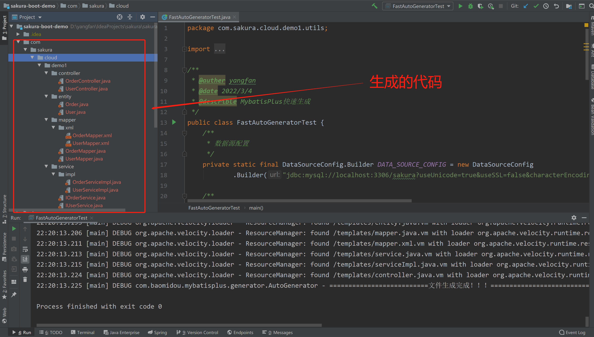

### sakura-web

> web相关

1. #### 加入依赖
   
   ```xml
   <parent>
       <groupId>com.sakura</groupId>
       <artifactId>sakura-web</artifactId>
       <version>1.0</version>
   </parent>
   ```

2. #### 集成了Swagger-ui
   
   `swagger-ui`的配置类：[Swagger2Config.java](https://github.com/yanjingfan/boot-parent/blob/master/sakura-web/src/main/java/com/sakura/common/web/config/Swagger2Config.java)
   
   **注意：**新建工程的包结构为：`com.sakura.cloud`
   
   集成后，启动项目后的访问地址：
   
   [http://localhost:8080/doc.html](http://localhost:8080/doc.html)
   
   或
   
   [http://localhost:8080/swagger-ui/index.html](http://localhost:8080/swagger-ui/index.html)

3. #### 集成了SQL防注入、XXS、CSRF
   
   + 关闭csrf检查
     
     如果不需要CSRF，可配置关闭
     
     ```yaml
     # 信息安全
     security:
       csrf:
         enable: false   # false表示关闭，true为打开，默认打开
         excludes:
           - /img        #忽略检查的url
           - /js
     ```
   
   + 关闭sql盲注
     
     如果不需要sql盲注拦截，可配置关闭
     
     ```yaml
     # 信息安全
     security:
       sql:
         enable: false   # false表示关闭，true为打开，默认打开
         excludes:
           - /img        #忽略检查的url
           - /js
     ```

4. #### 动态修改输出日志等级
   
   默认不开启此功能，如需开启，添加如下配置
   
   ```yaml
   log:
     update-level:
       enable: true
   ```
   
   **接口详情**
   
   修改输出日志等级接口: `/log/{level}/{pkn}`
   
   请求类型：`POST`请求
   
   请求参数：
   
   | 参数名   | 是否必填 | 类型     | 说明                                                  |
   | ----- | ---- | ------ | --------------------------------------------------- |
   | level | 是    | string | 日志等级参数（TRACE, DEBUG, INFO, WARN, ERROR, FATAL, OFF） |
   | pkn   | 是    | String | 需要改变日志等级的包                                          |

   **示例**

   需求：项目中的`com.sakura.cloud.demo1.controller`包中只打印`ERROR`日志

   操作：使用`postman`等一些工具发送`post`请求

   请求路径和参数：`localhost:8080/log/ERROR/com.sakura.cloud.demo1.controller`

   返回结果：

```json
{
    "code": 200,
    "message": "操作成功",
    "data": "[com.ly.cloud.demo1.controller]包下的日志级别成功改为[ERROR]"
}
```

   **测试验证**：

   访问`LogChangeController`中的`/test`接口，控制台只打印error日志

```txt
2021-01-15 15:26:48.691 ERROR 11248 --- [nio-8080-exec-4] c.s.c.d.controller.LogChangeController   : 这是一个error日志...
```

5. #### 跨服务调用
   
   > 需要在启动类上添加`@EnableFeignClients`注解
   
   1. 需要在启动类上添加`@EnableFeignClients`注解
      
      ```java
      @EnableFeignClients
      public class DemoApplication {
          public static void main(String[] args) {
              SpringApplication.run(DemoApplication.class, args);
          }
      }
      ```
   
   2. 添加`remote层`
      
      代码示例：[AppsServiceFeignClient](https://github.com/yanjingfan/sakura-boot-demo/blob/master/src/main/java/com/sakura/cloud/demo1/remote/AppsServiceFeignClient.java)
   
   3. 添加`feign层`
      
      调用远程服务接口处理
      
      代码示例：[AppsFeignClientFallbackFactory](https://github.com/yanjingfan/sakura-boot-demo/blob/master/src/main/java/com/sakura/cloud/demo1/remote/feign/AppsFeignClientFallbackFactory.java)
   
   4. 远程接口调用示例
      
      参考[RemoteApiController](https://github.com/yanjingfan/sakura-boot-demo/blob/master/src/main/java/com/sakura/cloud/demo1/controller/RemoteApiController.java)类中的queryApps方法，在service层注入`AppsServiceFeignClient`对象，即可调用远程接口

6. #### 使用restTemplate调用远程接口
   
   RestTemplate 提供了多种便捷访问远程Http服务的方法，能够大大提高客户端的编写效率。
   
   可参考demo工程中的[RemoteApiController](https://github.com/yanjingfan/sakura-boot-demo/blob/master/src/main/java/com/sakura/cloud/demo1/controller/RemoteApiController.java)类中的`queryRemoteUsers`和`queryRemoteApps`方法，分别提供了`GET`和`POST`两种远程请求方式的示例，编码简单高效，也不再需要手动关闭资源。

7. #### 代码生成器
   
   参考文档：[代码生成器（新） | MyBatis-Plus (baomidou.com)](https://baomidou.com/pages/779a6e/#%E5%BF%AB%E9%80%9F%E5%85%A5%E9%97%A8)
   
   **示例**：
   
   ```java
   public class FastAutoGeneratorTest {
       /**
        * 数据源配置
        */
       private static final DataSourceConfig.Builder DATA_SOURCE_CONFIG = new DataSourceConfig
               .Builder("jdbc:mysql://localhost:3306/sakura?useUnicode=true&useSSL=false&characterEncoding=utf8&serverTimezone=Asia/Shanghai", "root", "admin");
   
       /**
        * 执行 run
        */
       public static void main(String[] args) {
           FastAutoGenerator.create(DATA_SOURCE_CONFIG)
                   // 全局配置
                   .globalConfig((scanner, builder) ->
                           builder.author("yangfan")// 设置作者
   //                                .enableSwagger() // 开启 swagger 模式
                                   .fileOverride() // 覆盖已生成文件
                                   .outputDir(".") // 指定输出目录，目前生成在当前目录下
                                   .disableOpenDir()
                   )
   
                   // 包配置
                   .packageConfig((scanner, builder) ->
                           builder.parent("com.sakura.cloud") // 设置父包名
                                   .moduleName("demo1") // 设置父包模块名
                   )
                   // 策略配置
                   .strategyConfig((scanner, builder) ->
                           builder.addInclude("t_order", "t_user") // 多个表名用,隔开
                                   .addTablePrefix("t_") // 忽略表前缀，生成文件的时候，不会包含T前缀
                                   .controllerBuilder().enableRestStyle().enableHyphenStyle()
                                   .entityBuilder().enableLombok().addTableFills(new Column("update_time", FieldFill.INSERT))
                                   .build()
                   )
                   /*
                       模板引擎配置，默认 Velocity 可选模板引擎 Beetl 或 Freemarker
                      .templateEngine(new BeetlTemplateEngine())
                      .templateEngine(new FreemarkerTemplateEngine())
                    */
                   .execute();
       }
   }
   ```
   
   运行上面示例前，先初始化脚本：[表t_user & t_order](https://github.com/yanjingfan/sakura-boot-demo/blob/master/web/src/main/resources/db/migration/V2021080601__web-service-demo-1.0.0_%E5%88%9D%E5%A7%8B%E5%8C%96%E8%84%9A%E6%9C%AC.sql)
   
   生成的代码如图：
   
   
   
   


