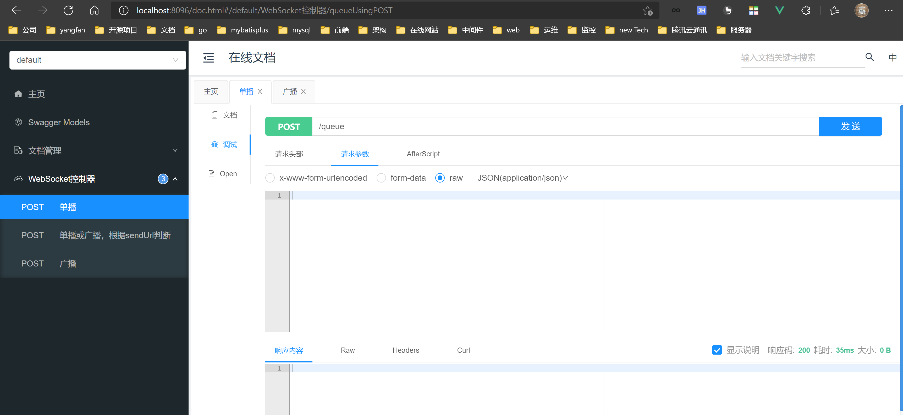
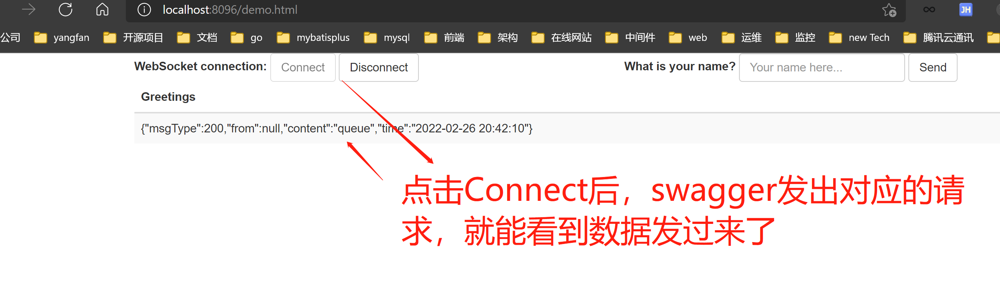
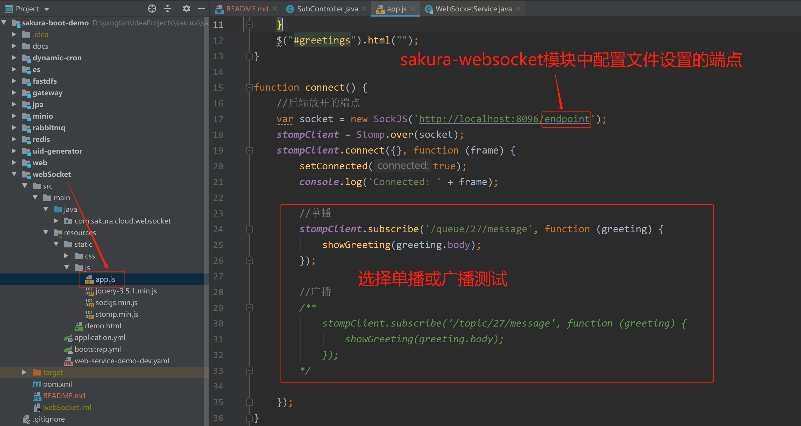

先启动本地的`nacos`，然后启动此demo

访问`swagger`：[http://localhost:8096/doc.html](http://localhost:8096/doc.html)

访问`测试websocket效果`的页面：[http://localhost:8096/demo.html](http://localhost:8096/demo.html)

#### 

测试页面配置修改，发送广播或者单播请求，这里的`app.js`做对应的修改即可

